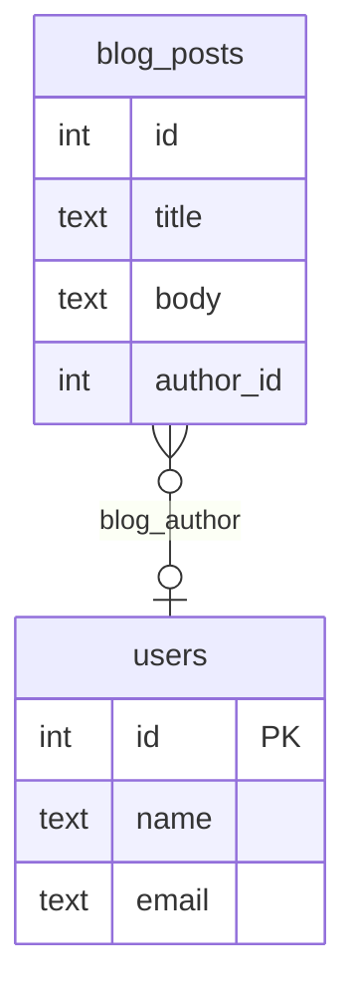

import InstallationInstructions from '../../md/components/_installation_instructions.mdx'

Hi everyone,

It's been a while since our last version announcement and today I'm happy to share with you
[v0.16](https://github.com/ariga/atlas/releases/tag/v0.16.0), which includes some
very exciting improvements for Atlas:

* **ClickHouse Beta Support** - ClickHouse is a high-performance, columnar database optimized for analytics
  and real-time query processing. Support for ClickHouse in Atlas has been one of the top requested features
  by our community in the past year. Today, we are happy to announce that ClickHouse is officially in Beta!
* **Hibernate Provider** - Atlas now supports loading the desired state of your database directly from your
  Hibernate code. Hibernate developers can now join developers from the [GORM](/guides/orms/gorm),
  [Sequelize](/guides/orms/sequelize), [TypeORM](/guides/orms/typeorm) and
  more communities who can now use Atlas to manage their database schema.
* **Baseline Schemas** - In some cases, your migrations rely on certain database objects to exist apriori to
  your application schema, for example extensions or legacy tables. Atlas now supports defining a baseline
  schema which will be loaded before automatically planning and applying your migrations.
* **Proactive conflict detection** - Teams that have connected their project to Atlas Cloud will get a prompt
  in the CLI if their migration directory is out of sync with the latest version in Atlas Cloud. This ensures that
  new migration files are added in a sequential order, preventing unexpected behavior.
* **Mermaid Support** - Atlas now supports generating a [Mermaid](https://mermaid.js.org/) diagram
  of your database schema. This is a great way to visualize your database schema and share it with your team.
* **Review Policies** - Users working with declarative migrations can now define "review policies" which
  can define thresholds for which kinds of changes require human review and which can be auto-applied.
* **Postgres Sequences** - Another long awaited feature, Atlas now supports managing sequences in PostgreSQL.

I know that's quite a list, so let's dive right in!

### ClickHouse Support {#clickhouse-beta-program}

[ClickHouse](https://clickhouse.com/) is a high-performance, columnar database optimized for analytics and real-time query processing.
Support for ClickHouse in Atlas has been one of the top requested features by our community in the past year.
Our team has been working hard to bring this feature to you and today we are happy to announce that ClickHouse is now available to use in Beta!

Here's what you need to do to get started:

1. Log in to your [Atlas Cloud](https://atlasgo.cloud) account. If you don't have an account yet, you can
   [sign up for free](https://atlasgo.cloud/signup).
2. Download the latest version of the Atlas CLI:
   <InstallationInstructions/>
4. Log in to your Atlas Cloud account from the CLI:
   ```bash
   atlas login
   ```
5. Spin up a local ClickHouse instance:
   ```bash
   docker run -d --name clickhouse-sandbox -p 9000:9000 -d clickhouse/clickhouse-server:latest
   ```
5. Verify that you are able to connect to this instance:
   ```bash
   atlas schema inspect -u 'clickhouse://localhost:9000'
   ```
   If everything is working correctly, you should see the following output:
   ```text
    schema "default" {
      engine = Atomic
    }
   ```
6. Create a new file named `schema.hcl` with the following content:
   ```hcl
    schema "default" {
     engine = Atomic
    }

    table "users" {
      schema = schema.default
      engine = MergeTree
      column "id" {
         type = UInt32
      }
      column "name" {
        type = String
      }
      column "created" {
        type = DateTime
      }
      primary_key {
        columns = [column.id]
      }
    }
   ```
7. Run the following command to apply the schema to your local ClickHouse instance:
   ```bash
    atlas schema apply -u 'clickhouse://localhost:9000' -f schema.hcl
   ```
   Atlas will prompt you to confirm the changes:
   ```text
    -- Planned Changes:
    -- Create "users" table
    CREATE TABLE `default`.`users` (
      `id` UInt32,
      `name` String,
      `created` DateTime
    ) ENGINE = MergeTree
     PRIMARY KEY (`id`) SETTINGS index_granularity = 8192;
   ```
   Hit "Enter" to apply the changes.
8. Amazing! Our schema has been applied to the database!

### Hibernate Provider

Atlas now supports loading the desired state of your database directly from your Hibernate code.
Packaged as both a Maven and Gradle plugin, the Hibernate provider allows you seamlessly integrate
Atlas into your existing Hibernate project.

Hibernate ships with an automatic schema management tool called [`hbm2ddl`](https://docs.jboss.org/hibernate/orm/6.4/userguide/html_single/Hibernate_User_Guide.html#schema-generation).
Similarly to Atlas, this tool can inspect a target database and automatically migrate the schema to the desired one.
However, the Hibernate team has been advising for years **not** to use this tool in production:

> Although the automatic schema generation is very useful for testing and prototyping purposes,
  in a production environment, it’s much more flexible to manage the schema using incremental migration scripts.

This is where Atlas comes in. Atlas can read Hibernate schema and plan database schema migrations.

To get started, refer to the [blog post we published](2023-12-12-hibernate-schema-loader.mdx) earlier this week.

### Baseline Schemas

:::info LOGIN REQUIRED

The `docker` block is available for logged-in users only. To use this feature, run:

```
atlas login
```
:::

In some cases, there is a need to configure a baseline schema for the dev database so that every computation using the
dev-database starts from this baseline. For example, users' schemas or migrations rely on objects, extensions, or
other schema resources that are not managed by the project.

To configure such a baseline, use the `docker` block with the relevant image and pass to it the script for creating the
base schema for the project:

```hcl
docker "postgres" "dev" {
  image  = "postgres:15"
  schema = "public"
  // highlight-start
  baseline = <<SQL
   CREATE SCHEMA "auth";
   CREATE EXTENSION IF NOT EXISTS "uuid-ossp" SCHEMA "auth";
   CREATE TABLE "auth"."users" ("id" uuid NOT NULL DEFAULT auth.uuid_generate_v4(), PRIMARY KEY ("id"));
  SQL
  // highlight-end
}

env "local" {
  src = "file://schema.pg.hcl"
  dev = docker.postgres.dev.url
}
```
For more details [refer to the documentation](/concepts/dev-database#baseline-schema).

### Proactive conflict detection

Teams that have connected their project to Atlas Cloud (see [setup](/cloud/setup-ci)) will get a prompt in the CLI if
their migration directory is out of sync with the latest version in Atlas Cloud. This ensures that new migration files are
added in a sequential order, preventing unexpected behavior. For example:

```text
atlas migrate diff --env dev

//highlight-start
? Your directory is outdated (2 migrations behind). Continue or Abort:
//underline-next-line
▸ Continue (Rebase later)
  Abort (Pull changes and re-run the command)
//highlight-end
```

Additionally, the [`atlas migrate lint`](/versioned/lint) command helps enforce this requirement during the CI stage.
Learn more on how to integrate Atlas into your [**GitHub Actions**](/cloud/setup-ci) or [**GitLab**](/guides/ci-platforms/gitlab) CI pipelines.

### Mermaid Support

Atlas now supports generating a [Mermaid](https://mermaid.js.org/) diagram of your database schema. Let's demonstrate
this feature using an example schema for a local SQLite database. First, we'll create a new file named `sqlite.hcl` with
the following content:

```hcl title=sqlite.hcl
schema "default" {
}

table "users" {
  schema = schema.default
  column "id" {
    type = int
  }
  column "name" {
    type = text
  }
  column "email" {
    type = text
  }
  primary_key {
    columns = [column.id]
  }
}

table "blog_posts" {
  schema = schema.default
  column "id" {
    type = int
  }
  column "title" {
    type = text
  }
  column "body" {
    type = text
  }
  column "author_id" {
    type = int
  }
  foreign_key "blog_author" {
    columns = [column.author_id]
    ref_columns = [table.users.column.id]
  }
}
```

Run the following command to inspect the schema and generate the Mermaid code:

```
atlas schema inspect -u file://sqlite.hcl --dev-url 'sqlite://?mode=memory' --format "{{ mermaid . }}"
```

The output will look like this:



Next, copy this output and paste it into the [Mermaid Live Editor](https://mermaid-js.github.io/mermaid-live-editor).

The result should look like this:


### Review Policies

Users working with declarative migrations can now define "review policies" which can define thresholds for which kinds
of changes require human review and which can be auto-applied.

By default, when running `atlas schema apply` on a target database, if any changes to the target database are required,
Atlas will prompt the user to confirm the changes. This is a safety measure to prevent accidental changes to the target
database.

However, Atlas ships with an analysis engine that can detect the impact of different changes to the target database.
For example, Atlas can detect irreversible destructive changes that will result in data loss or data dependent changes
that may fail due to data integrity constraints.

With review policies, you can tell Atlas to first analyze the proposed changes and only prompt the user if the changes
are above a certain risk threshold. For example, you can configure Atlas to only ask for review if any warnings are found
and to automatically apply all changes that do not trigger any diagnostics:

```hcl title=atlas.hcl
lint {
  review = WARNING
}
```

You can see a live demonstration of this feature towards the end of our recent
[HashiCorp conference talk](https://youtu.be/g_cA8fDEEd4?list=PL81sUbsFNc5YhJ8TLUd_IMZsstM4XbRtk&t=1477).

### Postgres Sequences

:::info BETA FEATURE
Sequences are currently in beta and available to logged-in users only. To use this feature, run:
```
atlas login
```
:::

The `sequence` block allows defining a sequence number generator. Supported by PostgreSQL.

Note, a `sequence` block is printed by Atlas on inspection, or it may be manually defined in the schema only if it
represents a PostgreSQL sequence that is not implicitly created by the database for identity or `serial` columns.

```hcl
#highlight-next-line
# Simple sequence with default values.
sequence "s1" {
  schema = schema.public
}

#highlight-next-line
# Sequence with custom configuration.
sequence "s2" {
  schema    = schema.public
  type      = smallint
  start     = 100
  increment = 2
  min_value = 100
  max_value = 1000
}

#highlight-next-line
# Sequence that is owned by a column.
sequence "s3" {
  schema  = schema.public
  owner   = table.t2.column.id
  comment = "Sequence with column owner"
}

#highlight-next-line
# The sequences created by this table are not printed on inspection.
table "users" {
  schema = schema.public
  column "id" {
    type = int
    identity {
        generated = ALWAYS
        start = 10000
    }
  }
  column "serial" {
    type = serial
  }
  primary_key  {
    columns = [column.id]
  }
}

table "t2" {
  schema = schema.public
  column "id" {
    type = int
  }
}

schema "public" {
  comment = "standard public schema"
}
```

### Wait, there's more!

A few other notable features shipped in this release are:

* **Analyzers for detecting blocking enum changes on MySQL.** Certain kinds of changes to `enum` columns
  on MySQL tables change the column type and require a table copy. During this process, the table is locked
  for write operations which can cause application downtime.

  Atlas now ships with analyzers that can detect such changes and warn the user before applying them.
  For more information see the documentation for analyzers [MY111](/lint/analyzers#MY111), [MY112](/lint/analyzers#MY112)
  and [MY113](/lint/analyzers#MY113).
* **The `external` data source** - The `external` data source allows the execution of an external program and uses its output in the project.

  For example:

    ```hcl title="atlas.hcl"
    data "external" "dot_env" {
      program = [
        "npm",
        "run",
        "load-env.js"
      ]
    }

    locals {
      dot_env = jsondecode(data.external.dot_env)
    }

    env "local" {
      src = local.dot_env.URL
      dev = "docker://mysql/8/dev"
    }
    ```

### Wrapping up

That's it! I hope you try out (and enjoy) all of these new features and find them useful.
As always, we would love to hear your feedback and suggestions on our [Discord server](https://discord.gg/zZ6sWVg6NT).
